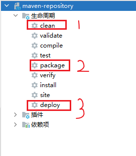
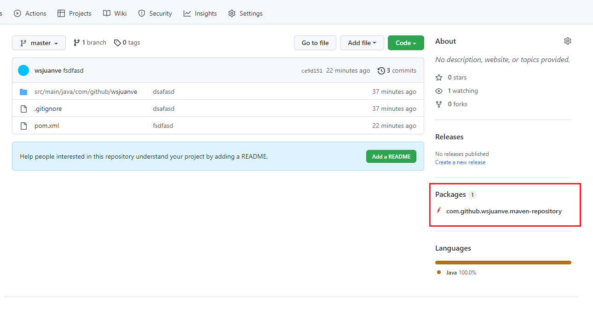
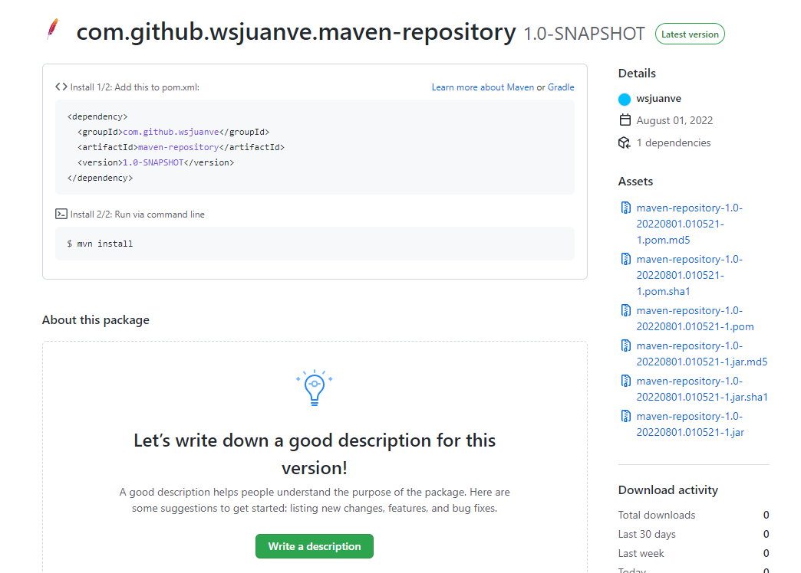

#

### 1. 生成githubToken

[https://github.com/settings/tokens](https://github.com/settings/tokens)

### 2. maven目录下面的settings.xml中增加配置

```xml

<settings xmlns="http://maven.apache.org/SETTINGS/1.0.0"
  xmlns:xsi="http://www.w3.org/2001/XMLSchema-instance"
  xsi:schemaLocation="http://maven.apache.org/SETTINGS/1.0.0 http://maven.apache.org/xsd/settings-1.0.0.xsd">

  <activeProfiles>
    <activeProfile>github</activeProfile>
  </activeProfiles>

  <profiles>
    <profile>
      <id>github</id>
      <repositories>
        <repository>
          <id>central</id>
          <url>https://repo1.maven.org/maven2</url>
          <releases>
            <enabled>true</enabled>
          </releases>
          <snapshots>
            <enabled>true</enabled>
          </snapshots>
        </repository>
        <repository>
          <id>github</id>
          <name>GitHub OWNER Apache Maven Packages</name>
          <!--username替换为 github的用户名或你所属组织的名称；repository替换为项目名称-->
          <url>https://maven.pkg.github.com/username/repository</url>
        </repository>
      </repositories>
    </profile>
  </profiles>

  <servers>
    <server>
      <id>github</id>
      <!--username替换为 github的用户名-->
      <username>username</username>
      <!--token替换为 第一步中生成的GITHUB_TOKEN -->
      <password>token</password>
    </server>
  </servers>
</settings>
```

### 3. 修改项目终端pom.xml

```xml

<distributionManagement>
  <repository>
    <id>github</id>
    <name>GitHub OWNER Apache Maven Packages</name>
    <!--username替换为 github的用户名或你所属组织的名称；repository替换为项目名称-->
    <url>https://maven.pkg.github.com/username/repository</url>
  </repository>
</distributionManagement>
```

### 4. 执行命令（忽略测试）

```shell
$ mvn clean deploy -Dmaven.test.skip=true
```

或者



> <font style="color : #ff0000" size="5">注意</font>，要先将项目上传至仓库，再执行

### 5. 仓库

> 执行完成后就可以看见这个
>
> 
>
> 

### 6. 添加依赖

在需要添加依赖的项目的pom.xml增加

```xml
<distributionManagement>
  <repository>
    <id>github</id>
    <name>GitHub OWNER Apache Maven Packages</name>
    <!--username替换为 github的用户名或你所属组织的名称；repository替换为项目名称-->
    <url>https://maven.pkg.github.com/username/repository</url>
  </repository>
</distributionManagement>

<dependencies>
  <dependency>
    <groupId>com.github.wsjuanve</groupId>
    <artifactId>maven-repository</artifactId>
    <version>1.0-SNAPSHOT</version>
  </dependency>
</dependencies>
```
```shell
$ mvn install
```

或者再manven中的setting.xml中添加maven源，指向github仓库

